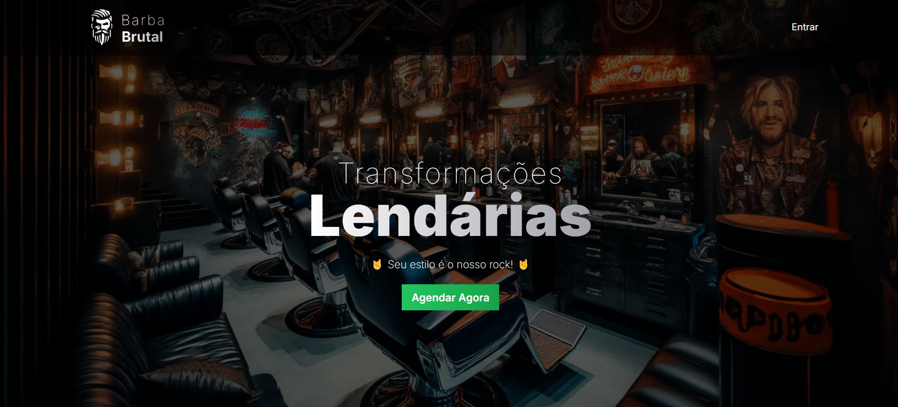
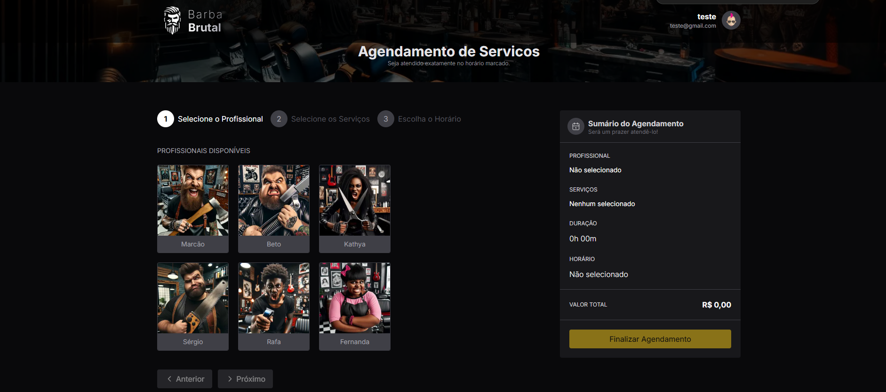
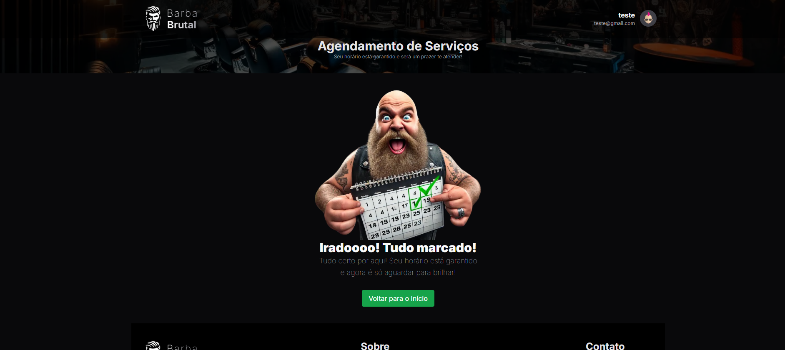

# barba-brutal

Aplicação para agendamento e gerenciamento de horários em uma barbearia. Desenvolvido com NestJS no backend e Next.js com TypeScript no frontend.





## 🤔 O que é este projeto

Barba Brutal é uma plataforma desenvolvida para agendamento e gerenciamento de horários em uma barbearia. A aplicação permite que os clientes reservem seus horários de atendimento e que os administradores controlem os agendamentos de forma eficiente, além de gerenciar as informações dos serviços e profissionais.

## 🖥️ Como rodar este projeto

**Requisitos**:

- Node.js instalado
- PostgreSQL configurado
- Docker (opcional, para ambiente conteinerizado)

1. Clone este repositório:

```sh
git clone https://github.com/seu-repositorio/barba-brutal.git
```

2. Acesse o diretório do projeto:

```sh
cd barba-brutal
```

3. Instale as dependências:

```sh
npm install
```

4. Configure as variáveis de ambiente:  
   Crie um arquivo .env baseado no .env.example e preencha com as credenciais do banco de dados e demais configurações.

5. Execute as migrações do banco:

```sh
npx prisma migrate dev
```

6. Inicie o servidor backend (NestJS):

```sh
npm run start:dev
```

7. Inicie o frontend (Next.js):

```sh
npm run dev
```

8. Acesse o projeto em [http://localhost:3000](http://localhost:3000).

## 🗒️ Features do projeto

- Agendamento e gerenciamento de horários online
- Criação de cadastro para clientes e profissionais
- Controle de serviços oferecidos e valores
- Notificações de agendamento

## 💻 Tecnologias usadas no projeto

<div style="display: grid; grid-template-columns: repeat(auto-fit, minmax(80px, 1fr)); gap: 10px; align-items: center;">


</div>

## ⚙️ Sobre o desenvolvimento desse projeto

Este projeto fullstack foi desenvolvido com uma arquitetura que separa claramente o frontend e o backend, garantindo uma comunicação eficiente entre as camadas.

- **Frontend**: Desenvolvido com Next.js, proporcionando uma experiência dinâmica e responsiva.
- **Backend**: Construído com NestJS, que oferece escalabilidade e robustez na criação da API.
- **Banco de dados**: Utiliza PostgreSQL, com migrations e modelos gerenciados pelo Prisma.

A utilização de Docker é opcional e permite a execução do ambiente de forma conteinerizada, facilitando a integração e o deploy.

## 💎 Links úteis

- [Next.js](https://nextjs.org/docs)
- [NestJS](https://docs.nestjs.com/)
- [Prisma](https://www.prisma.io/docs)
- [PostgreSQL](https://www.postgresql.org/docs/)
- [Tailwind CSS](https://tailwindcss.com/docs)
